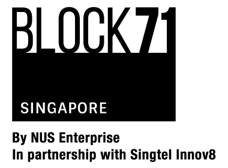
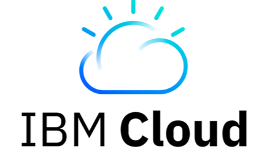

# Welcome to the first MAX-Model-Exchange Meetup in Singapore in 2019

**Date Time:** 
5th March, 7-9pm 

**Location:** 
BLOCK71 71 Ayer Rajah Crescent, #02-01, Singapore 139951 ([map](https://www.google.com/maps/place/BLOCK71+Singapore/@1.2967926,103.786762,15z/data=!4m2!3m1!1s0x0:0x7b4dee0cac5594e3?ved=2ahUKEwiAyYmtm-XgAhWMA3IKHefoDnsQ_BIwCnoECAEQCA))

## Overview

Come join like minded developers to learn how to use an OpenSource image segmentation deep learning model to detect different types of objects from within images, and build a drag-and-drop web application interface to combine them or create new images. 

During this meetup you will learn how to 
* Build a docker image of the Image Segmenter Model
* Deploy a deep learning model with a REST endpoint to a Cloud Kubernetes Cluster
* Recognize object segments in an image using the MAX Model’s REST API
* Run a web application that uses the model’s REST API on a Cloud Kubernetes Cluster
* Interact with processed object segments to create new images

## Brought to you by

## Agenda
| Time | Description |
| :---- |- |
| 18:30 | Check-in & Networking (food/beer) |
| 19:00 | Introductions |
| 19:10 | Code Overview and Discussion |
| 20:15 | Q & A
| 21:00 | Goodbyes |

## Speakers
| | |
|:--------:|:----|
| | [Flik CB Fok](https://www.linkedin.com/in/flik-fok-588a542a/), IBM Developer Advocate in Singapore.
| | [Justin McCoy](https://www.linkedin.com/in/mccoyjus/), IBM Developer Advocate in Austin, Texas. Sculpting a beautiful and simplified world through software and art. With 12 years of experience bringing the latest open source technologies to enterprise with IBM’s big iron, he knows what it takes to move from idea to production. With a passion for the client experience, he is currently focused on Cloud Computing, Machine Learning, Deep Learning, and Data Science. You’ll usually find him playing ultimate frisbee, running, or talking about the future of technology.|

## Additional Resources
* [IBM Cloud](https://cloud.ibm.com)
* [Request IBM Cloud Promo Code](https://ibm.biz/promo-code)
* [MAX Model Exchange](https://developer.ibm.com/exchanges/models/)
* [Cloud Kubernetes Service](https://cloud.ibm.com/containers-kubernetes/catalog/cluster)
* [Free code on IBM Developer](https://developer.ibm.com)
* [Dockerhub](https://hub.docker.com/)
